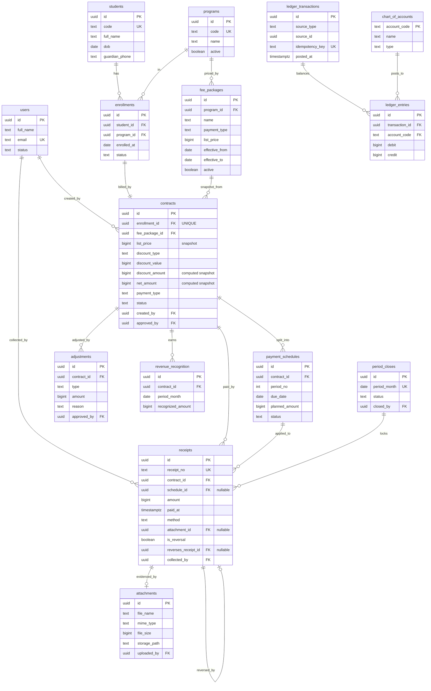

# 03 — ERD & Đặc tả thực thể

Sơ đồ dưới đây gồm **toàn bộ 4 giai đoạn**. Bảng thuộc GĐ1 được đánh dấu 🟢; GĐ2 🟡; GĐ3 🟠; GĐ4 🔵.
Code GĐ1 chỉ cần dựng các bảng 🟢 (xem DDL ở `07-schema-phase1.sql`), nhưng nên đọc cả sơ đồ để đặt khoá/cột đúng ngay từ đầu.

## 3.1 Sơ đồ (Mermaid)

## 3.2 Đặc tả các thực thể GĐ1 🟢

### `users`
Người dùng hệ thống. Vai trò xem `04-rbac-permissions.md`.
- `role` (text/enum): `master_admin | accountant | cashier | admissions | principal`. Một user có thể mang **nhiều** vai trò (dùng bảng `user_roles` nếu cần) — hiện tại một người kiêm nhiệm.
- `status`: `active | disabled`.

### `students`
- `code`: mã học sinh nội bộ, UNIQUE.
- `guardian_phone`, `guardian_name`: liên hệ phụ huynh (phục vụ nhắc công nợ).
- KHÔNG chứa thông tin học phí — học phí nằm ở enrollment/contract.

### `programs`
Chương trình học (V-ACT, SAT…). `code` UNIQUE.

### `fee_packages` (versioned)
Gói học phí = chương trình + hình thức đóng + giá niêm yết.
- `payment_type`: `one_time | monthly | quarterly | installment`.
- `list_price` BIGINT (VND).
- `effective_from` / `effective_to`: khoảng hiệu lực. `effective_to = NULL` là bản đang áp dụng. **Đổi giá = tạo dòng mới**, set `effective_to` cho dòng cũ. Không UPDATE giá tại chỗ.
- Import dữ liệu hiện có của trung tâm vào đây.

### `enrollments`
Một lượt ghi danh.
- `status`: `active | completed | withdrawn | retake`.
- `(student_id, program_id, enrolled_at)` không bắt buộc unique (cho phép học lại cùng chương trình).

### `contracts`
Thực thể trung tâm.
- `enrollment_id` **UNIQUE** (INV-8): mỗi lượt ghi danh một hợp đồng.
- `list_price`: **snapshot** copy từ `fee_packages.list_price` lúc tạo.
- `discount_type` / `discount_value` / `discount_amount` / `net_amount`: xem công thức `02`.
- `payment_type`: sao chép từ gói (có thể khác nếu cho phép).
- `status`: `draft | pending_approval | active | completed | cancelled`. Chỉ `active` mới sinh/áp lịch đóng & cho thu tiền.
- `created_by`, `approved_by`, `activated_at`.

### `payment_schedules`
Các kỳ của hợp đồng.
- `period_no`: 1,2,3…
- `planned_amount`: số dự kiến của kỳ (hệ thống đề xuất, admin sửa được — GĐ2).
- `status`: xem `02` (suy ra từ due_date + thực thu; có thể cache hoặc tính động).

### `receipts` (append-only)
Mỗi lần nhận tiền.
- `receipt_no`: mã tự sinh, UNIQUE (vd `PT-2026-000123`).
- `schedule_id` nullable: kỳ mà khoản thu này áp vào (khi nạp dữ liệu quá khứ có thể để NULL rồi map sau).
- `amount` BIGINT > 0.
- `method`: `cash | bank_transfer`.
- `attachment_id` nullable (file biên lai).
- `is_reversal` + `reverses_receipt_id`: cơ chế phiếu đảo (dùng ở GĐ2, cột có sẵn từ GĐ1 để khỏi migrate).
- `collected_by`, `paid_at`, `created_at` (immutable).

### `attachments`
- `mime_type` chỉ nhận: `image/jpeg | image/png | image/heic | application/pdf`.
- `file_size`: giới hạn (gợi ý ≤ 10 MB).
- `storage_path`: đường dẫn trong Storage (Supabase Storage / S3…).

### `audit_logs`
- `user_id`, `action`, `entity_type`, `entity_id`, `before` (jsonb), `after` (jsonb), `created_at`.

## 3.3 Thực thể giai đoạn sau (chỉ mô tả, chưa code GĐ1)
- `adjustments` 🟡 — hoàn/ghi giảm/chuyển chương trình.
- `revenue_recognition` 🟠 — ghi nhận doanh thu theo tháng/tiến độ (tầng 4–5).
- `period_closes` 🟠 — chốt sổ tháng.
- `chart_of_accounts`, `ledger_transactions`, `ledger_entries` 🔵 — sổ cái kép + ánh xạ TK.
- `einvoice_exports` 🔵 — hàng đợi đẩy hoá đơn điện tử (idempotency).
